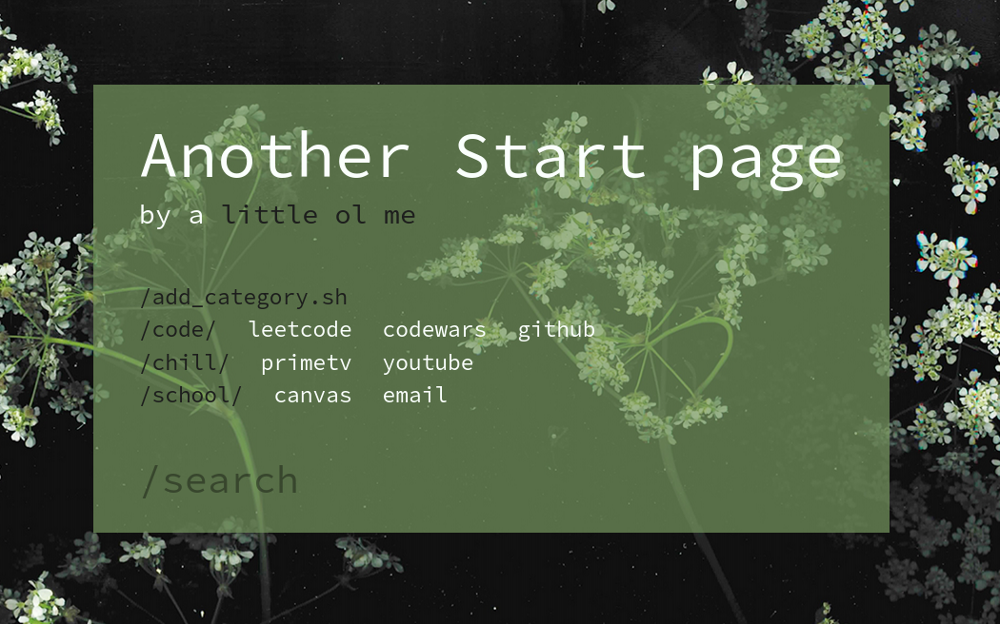

[](https://github.com/deBubz/startpage/actions/workflows/node.js.yml)

A simple and customizable startpage built using `React`. Currently hosted on [netlify](https://another-startpage.netlify.app/)

## To use

This page is currently hosted on [netlify](https://another-startpage.netlify.app/).
But if you want to load this faster, I reccomend to do the following

### Run locally

1. clone/download this repo
2. install project dependencies by running
```
yarn
```
3. build the static files 
```
yarn build
```
4. serve the static page
```sh
serve -s build -l <PORT_NUMBER>
# or
serve /path/to/build -l <PORT_NUMBER>
```
> **NOTE**: this starts a static server process locally on your machine.
> This processed will be killed every time you turn your computer off.
>
> You may need to create a serve script(step 4) which runs everytime your machine is booted up.

1. Get the browser extention for [firefox](https://addons.mozilla.org/en-US/firefox/addon/new-tab-override/) or [chrome](https://chrome.google.com/webstore/detail/custom-new-tab-url/mmjbdbjnoablegbkcklggeknkfcjkjia?hl=en)
6. set the new tab url to be where the page is served 

## Personal's Note

Alright I'm pretty much done with this project, 
but here are a few aspect I could improve on:

- Plan out ui components better before coding, I find myself copy/paste or rewriting code alot (just to make components reusable)
- Handling states better
  - use redux in bigger projects
  - use context in smaller projects. In this one I find myself passing state down the prop tree quite alot